<h1>
  
</h1>

This is a [DAP](https://microsoft.github.io/debug-adapter-protocol/)-based JavaScript debugger. It debugs Node.js, Chrome, Edge, WebView2, VS Code extensions, Blazor, React Native, and more. It is the default JavaScript debugger in Visual Studio Code and Visual Studio, and the standalone debug server can also be used in other tools such as [nvim](https://github.com/mxsdev/nvim-dap-vscode-js).

## Usage

If you're using Visual Studio or Visual Studio Code, `js-debug` is already installed. Otherwise, please consult your editor's documentation for possible installation instructions. Builds of the VS Code extension and standalone DAP server are available on the [releases](https://github.com/microsoft/vscode-js-debug/releases) page.

See [OPTIONS.md](./OPTIONS.md) for a list of options you can use in your launch configurations.

- For usage in VS Code, please check out our guides for [Node.js debugging](https://code.visualstudio.com/docs/nodejs/nodejs-debugging), [Browser debugging](https://code.visualstudio.com/docs/nodejs/browser-debugging).
- For debugging React Native, install and read through the [React Native](https://marketplace.visualstudio.com/items?itemName=msjsdiag.vscode-react-native) extension which builds upon `js-debug`.
- For debugging Blazor, check out [its documentation here](https://learn.microsoft.com/en-us/aspnet/core/blazor/debug?view=aspnetcore-8.0&tabs=visual-studio-code).
- For debugging WebView2 apps, check out [documentation here](https://learn.microsoft.com/en-us/microsoft-edge/webview2/how-to/debug-visual-studio-code).

### Nightly Extension

The shipped version of VS Code includes the js-debug version at the time of its release, however you may want to install our nightly build to get the latest fixes and features. The nightly build runs at 5PM PST on each day that there are changes ([see pipeline](https://dev.azure.com/vscode/VS%20Code%20debug%20adapters/_build?definitionId=28)). To get the build:

1. Open the extensions view (ctrl+shift+x) and search for `@builtin @id:ms-vscode.js-debug`
2. Right click on the `JavaScript Debugger` extension and `Disable` it.
3. Search for `@id:ms-vscode.js-debug-nightly` in the extensions view.
4. Install that extension.

## Notable Features

In `js-debug` we aim to provide rich debugging for modern applications, with no or minimal configuration required. Here are a few distinguishing features of `js-debug` beyond basic debugging capabilities. Please refer to the VS Code documentation for a complete overview of capabilities.

### Debug child processes, web workers, service workers, and worker threads

In Node.js, child processes and worker threads will automatically be debugged. In browsers, service workers, webworkers, and iframes will be debugged as well. While debugging workers, you can also step through `postMessage()` calls.

  
Preview

  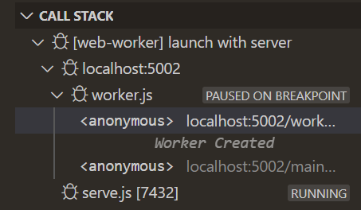

### Debug WebAssembly with DWARF symbols

The debugger automatically reads DWARF symbols from WebAssembly binaries, and debugs them. The usual debugging features are available, including limited evaluation support via `lldb-eval`.

  
Preview

  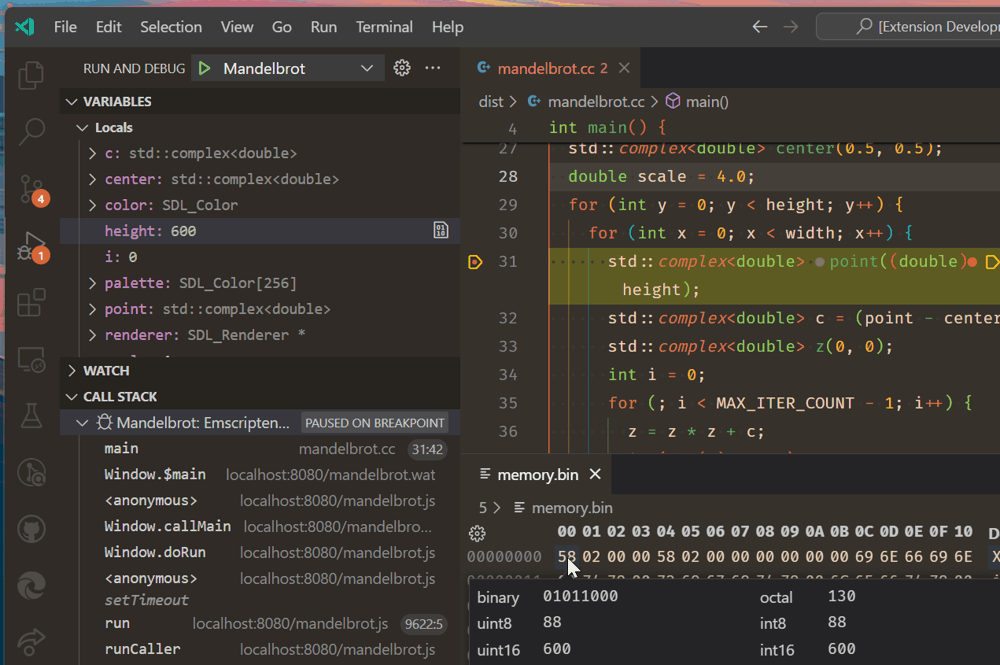

### Debug Node.js processes in the terminal

You can debug any Node.js process you run in the terminal with Auto Attach. If auto attach isn't on, you can run the command `Debug: Toggle Auto Attach` to turn it on. Next time you run a command like `npm start`, we'll debug it.

  
Preview

  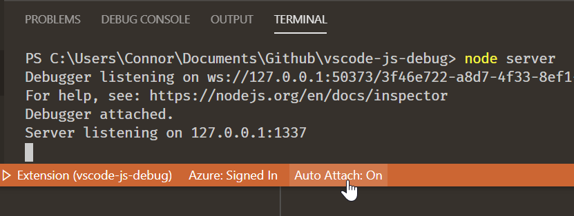

Once enabled, you can toggle Auto Attach by clicking the `Auto Attach: On/Off` button in the status bar on the bottom of your screen. You can also create a one-off terminal for debugging via the `Debug: Create JavaScript Debug Terminal` command.

### Profiling Support

You can capture and view performance profiles natively in VS Code, by clicking on the ⚪ button in the Call Stack view, or through the `Debug: Take Performance Profile` command. The profile information collected through VS Code is sourcemap-aware.

We support taking and visualizating CPU profiles, heap profiles, and heap snapshots.

  
Preview

  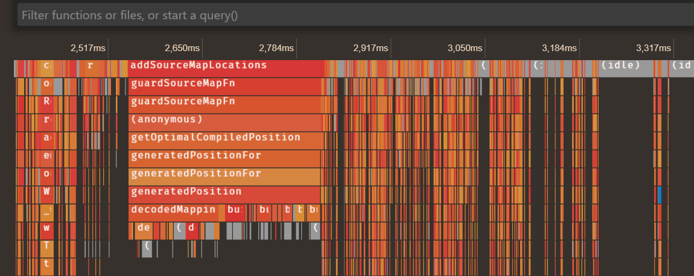

### Instrumentation breakpoints

When debugging web apps, you can configure instrumentation breakpoints from VS Code in the "Event Listener Breakpoints" view.

  
Preview

  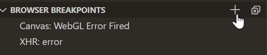
  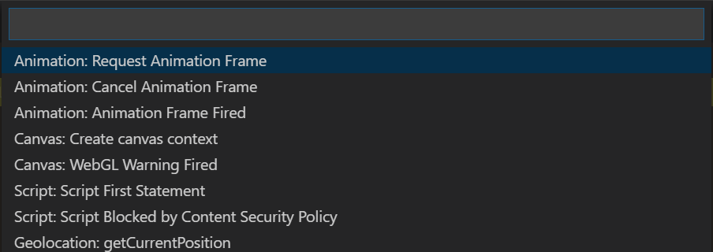

### Return value interception

On a function's return statement, you can use, inspect, and modify the `$returnValue`.

  
Preview

  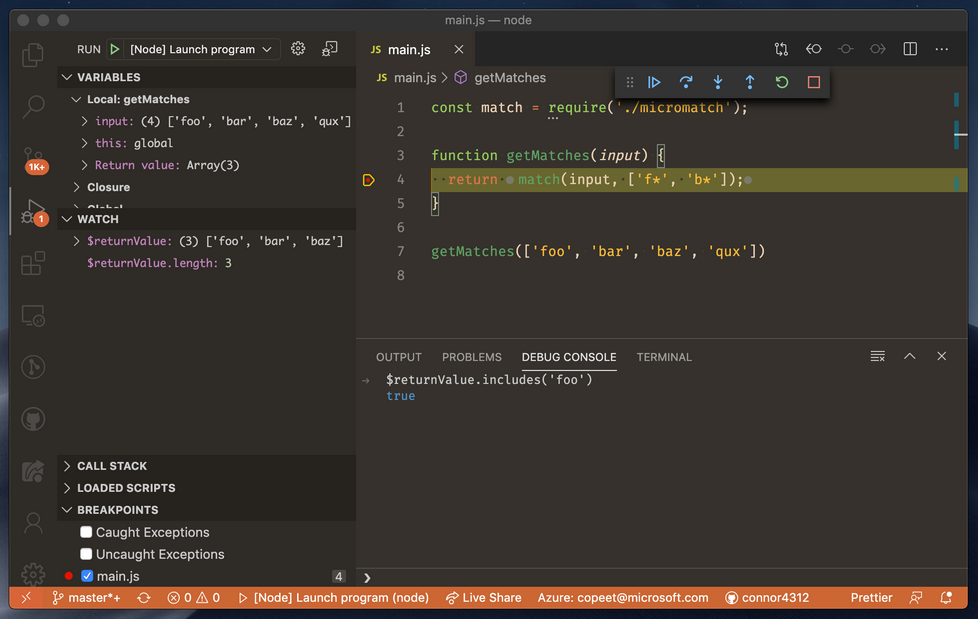

Note that you can use and modify properties on the `$returnValue`, but not assign it to--it is effectively a `const` variable.

### Pretty-print minified sources

The debugger can pretty print files, especially useful when dealing with minified sources. You can trigger pretty printing by clicking on the braces `{}` icon in editor actions, or via the `Debug: Pretty print for debugging` command.

  
Preview

  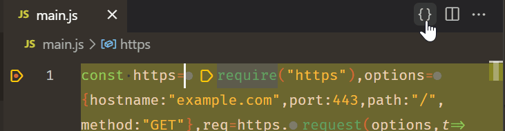

### Experimental Network View

The debugger allows viewing network traffic of browser targets and Node.js >22.6.0. This requires enabling the `debug.javascript.enableNetworkView` setting.

  
Preview

  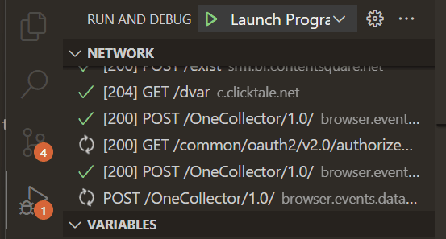

### Advanced Rename Support

When using a tool that emits renames in its sourcemap, the debugger maps renamed variables in all displayed views, and also rewrites evaluation requests to use the renamed identifiers, allowing near-source-level debugging of minified code.

### Conditional Exception Breakpoints

As in most debuggers, you can pause on caught exceptions, but you can also filter the exceptions you want to pause on by checking against the `error` object. In VS Code, you can do this by clicking the pencil icon in the Breakpoints view.

  
Preview

  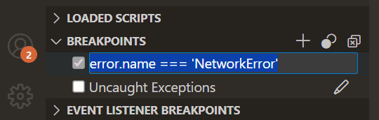

### Excluded Callers

If you have a breakpoint you want to pause on, but not when called from certain frames, you can right click on call frames in the stack trace view to "exclude caller" which prevents pausing on that breakpoint when the requested caller is in the stack trace.

  
Preview

  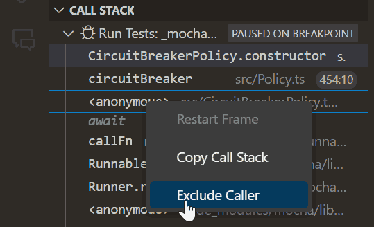

### Step-in Targets

When paused on a location with multiple calls or expressions, the debugger supports the **Debug: Step Into Target** action that allows you to request a specific expression you wish to step into.
